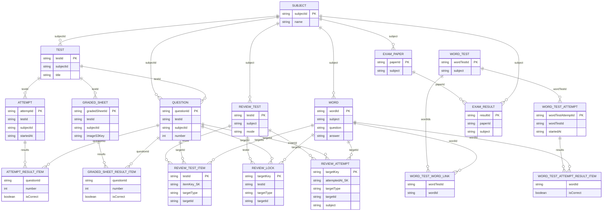

# DynamoDB テーブル定義（ドラフト）

本書は [docs/backend_api.md](backend_api.md) および [docs/swagger.yml](swagger.yml) をベースに、Smart Exam の DynamoDB テーブル定義（最小構成）を記載します。

- 前提: 現要件ではユーザー管理（ログイン等）を持たない
- そのため「誰の結果か」を厳密に区別しない（テスト結果は attempt 単位で保存し、取得は最新 attempt を返す想定）

---

## 1. 命名

- テーブル名は環境プレフィックスを付ける想定（例: `dev_attempts`, `prod_attempts`）
- 本書ではプレフィックス無しで記載

---

## 2. テーブル一覧

- `subjects` : 科目マスタ
- `tests` : テストマスタ
- `questions` : 問題マスタ
- `attempts` : 実施（attempt）と正誤結果
- `answer_sheets` : 印刷用 解答用紙
- `graded_sheets` : 採点済み用紙（アップロード/解析状態/正誤結果）
- `words` : 単語（Q/A）マスタ（単語テスト用）
- `word_tests` : 単語テスト（漢字テスト）とPDF
- `word_test_attempts` : 単語テストの正誤登録（提出）

---

## 2.1 テーブル関係図（db.ts ベース）

`backend/src/types/db.ts` の型定義に含まれる「ID参照（例: testId / questionId / paperId / subject）」を元に、テーブル間の論理的な関係を Mermaid で可視化します。

- DynamoDB は RDB の外部キー制約を持たないため、本図は **実装上の参照関係（論理ER）** です
- `AttemptTable.results` / `GradedSheetTable.results` / `WordTestAttemptTable.results` は **配列で埋め込み** のため、図では `*_RESULT_ITEM` として疑似エンティティ化しています
- `Review*` 系の `targetType` が `KANJI` の場合、参照先は専用テーブルではなく `WordTable`（漢字データも words に格納）です

---

## 3. テーブル定義

## 3.1 subjects

### 目的

- 科目一覧（科目別フィルタ）

### キー

- PK: `subject_id` (S)

### 属性

- `name` (S)

### 主なアクセス

- 一覧: Scan（データ量が増える場合は別途設計）
- 単体参照: GetItem(subject_id)

---

## 3.2 tests

### 目的

- 科目別のテスト一覧

### キー

- PK: `test_id` (S)

### 属性

- `subject_id` (S)
- `title` (S)
- `description` (S, nullable)
- `question_count` (N)

### GSI

- GSI1: `gsi_subject_id`
  - PK: `subject_id` (S)
  - SK: `test_id` (S)

### 主なアクセス

- テスト一覧（科目別）: Query(GSI1 PK=subject_id)
- 単体参照: GetItem(test_id)

---

## 3.3 questions

### 目的

- テスト内の問題一覧取得
- （任意）問題用紙PDFの S3 キーの管理

### キー

- PK: `question_id` (S)

### 属性

- `test_id` (S)
- `subject_id` (S)
- `number` (N) ※テスト内の問題番号
- `prompt_s3_key` (S, nullable)

### GSI

- GSI1: `gsi_test_id_number`
  - PK: `test_id` (S)
  - SK: `number` (N)

### 主なアクセス

- 問題一覧: Query(GSI1 PK=test_id, 昇順で number)
- 単体参照: GetItem(question_id)

---

## 3.4 attempts

### 目的

- 実施開始/提出
- 正誤結果の保管
- 直近 attempt の取得（`GET /v1/tests/{testid}/results`）

### キー

- PK: `attempt_id` (S)

### 属性

- `test_id` (S)
- `subject_id` (S)
- `status` (S: `IN_PROGRESS` | `SUBMITTED`)
- `started_at` (S, ISO)
- `submitted_at` (S, ISO, nullable)
- `results` (L) ※ `[{question_id, number, is_correct}]`

### GSI

- GSI1: `gsi_test_id_started_at`
  - PK: `test_id` (S)
  - SK: `started_at` (S)

### 主なアクセス

- 実施開始: PutItem(attempt)
- 提出: UpdateItem(attempt_id) で `status`, `submitted_at`, `results` を更新
- テスト結果（最新）:
  - Query(GSI1 PK=test_id, ScanIndexForward=false, Limit=1)
  - 取得した attempt の `results` を返す
- 不正解問題: 最新 attempt の `results` から `is_correct=false` を抽出

---

## 3.5 answer_sheets

### 目的

- 問題を手動選択して解答用紙を作成し、印刷できるようにする
- 生成した PDF の S3 キーを保持

### キー

- PK: `answer_sheet_id` (S)

### 属性

- `test_id` (S)
- `subject_id` (S)
- `question_ids` (L of S)
- `pdf_s3_key` (S)

### 主なアクセス

- 作成: PutItem(answer_sheet)
- ダウンロード: `pdf_s3_key` を使って署名URL発行（APIは別）

---

## 3.6 graded_sheets

### 目的

- 採点済み回答用紙のアップロード情報、AI解析状態、正誤結果の保持

### キー

- PK: `graded_sheet_id` (S)

### 属性

- `test_id` (S)
- `subject_id` (S)
- `image_s3_key` (S)
- `status` (S: `UPLOADED` | `ANALYZING` | `DONE` | `FAILED`)
- `ai_provider` (S: `BEDROCK` | `OPENAI` | `GOOGLE`)
- `results` (L, nullable) ※ `[{question_id, number, is_correct}]`
- `error_message` (S, nullable)

### 主なアクセス

- 登録: PutItem(graded_sheet, status=ANALYZING)
- 解析完了: UpdateItem(graded_sheet_id) で `status=DONE`, `results` を更新
- 取得: GetItem(graded_sheet_id)

---

## 3.7 words

### 目的

- 単語テスト（漢字テスト）用の単語（Q/A）を保管する

### キー

- PK: `word_id` (S)

### 属性

- `question` (S) ※例: 「肺は呼吸きかんの一部である。」
- `answer` (S) ※例: 「器官」
- `answer_hiragana` (S) ※PDF出力時に太字（bold）にする対象
- `word_type` (S: `KANJI`)

### GSI（任意）

- 漢字テスト作成時に `KANJI` のみ抽出したい場合
  - GSI1: `gsi_word_type`
    - PK: `word_type` (S)
    - SK: `word_id` (S)

### 主なアクセス

- 登録: PutItem(word)
- 一覧: Scan（データ量が増える場合は別途設計）
- 削除: DeleteItem(word_id)
- 漢字単語の抽出（任意）: Query(GSI1 PK=word_type)

---

## 3.8 word_tests

### 目的

- 指定数の単語テスト（漢字テスト）を作成し、一覧表示/削除/PDFダウンロードを可能にする

### キー

- PK: `word_test_id` (S)

### 属性

- `word_type` (S: `KANJI`)
- `count` (N)
- `word_ids` (L of S)
- `pdf_s3_key` (S, nullable)

### 主なアクセス

- 作成: PutItem(word_test)
- 一覧: Scan（データ量が増える場合は別途設計）
- 削除: DeleteItem(word_test_id)
- PDFダウンロード: `pdf_s3_key` を使って署名URL発行（APIは別）

---

## 3.9 word_test_attempts

### 目的

- 作成済み単語テストに対する正誤登録（提出）を保管する

### キー

- PK: `word_test_attempt_id` (S)

### 属性

- `word_test_id` (S)
- `status` (S: `IN_PROGRESS` | `SUBMITTED`)
- `started_at` (S, ISO)
- `submitted_at` (S, ISO, nullable)
- `results` (L)
  - `[{word_id, is_correct}]`

### GSI

- GSI1: `gsi_word_test_id_started_at`
  - PK: `word_test_id` (S)
  - SK: `started_at` (S)

### 主なアクセス

- 実施開始: PutItem(word_test_attempt)
- 提出: UpdateItem(word_test_attempt_id) で `status`, `submitted_at`, `results` を更新
- 最新の正誤取得（任意）:
  - Query(GSI1 PK=word_test_id, ScanIndexForward=false, Limit=1)

---

## 4. 注意点（実装/運用）

- `results` のサイズが大きくなる場合、DynamoDB アイテムサイズ制限（400KB）に注意
  - 将来的に、results を別テーブル（`attempt_results`）へ分離する選択肢あり
- `started_at` / `submitted_at` は ISO 文字列（例: `2025-12-18T00:00:00Z`）で統一
- テーブル/インデックスの具体的なプロビジョニング（PAY_PER_REQUEST 等）は Terraform 側で確定
